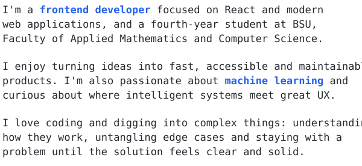

  

<table>
  <tr>
    <td width="62%" valign="top">
      <h2><samp>About me</samp></h2>
      
    </td>
    <td width="38%" valign="top">
      <h2><samp>Contact me</samp></h2>
      
<samp>Have an idea, a project, or just want to say hello? My inbox is open.</samp>

      

         
         
         
        
      

    </td>
  </tr>
</table>

<h3 align="center"><samp>GitHub activity</samp></h3>

  

<h3 align="center"><samp>Technology constellation</samp></h3>

<table>
  <tr>
    <td width="50%" align="center" valign="top">
      <h3><samp>Frontend</samp></h3>
      

        
        
        
        
        
        
        
        
        
        
      

    </td>
    <td width="50%" align="center" valign="top">
      <h3><samp>Beyond the browser</samp></h3>
      

        
        
        
        
        
        
        
        
        
        
      

    </td>
  </tr>
</table>

  <samp>Always learning · always building · open to collaboration</samp>

